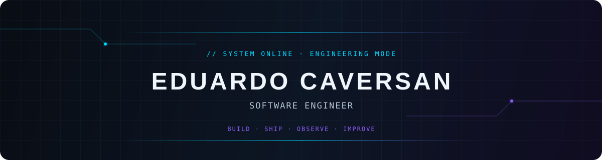

<p align="center">
  
</p>

<p align="center">
  
</p>

<p align="center">
  <a href="https://www.linkedin.com/in/deveduardocaversan/"></a>
  <a href="https://github.com/EduardoCaversan"></a>
  <a href="mailto:educaversan.dev@gmail.com"></a>
</p>

<p align="center">
  <code>BACKEND SYSTEMS</code> · <code>PRODUCTION-MINDED APIs</code> · <code>RELIABLE DELIVERY</code>
</p>

---

## Engineering, close to the metal

> Software Engineer focused on backend systems, resilient APIs, cloud infrastructure, and the operational details that make software dependable.

I build across the service boundary: modular backend applications, data models, authentication and authorization, real-time workflows, infrastructure provisioning, and automated validation. The work here is grounded in .NET, Node.js, Go, and TypeScript projects—not a generic technology checklist.

```text
eduardo@github:~$ focus
backend systems · APIs · concurrency · cloud infrastructure · reliability
```

## Engineering Arsenal

<p align="center">
  <strong>Backend</strong><br/>
  
  
  
  
  &nbsp;&nbsp;&nbsp;
  <strong>Data &amp; Real-time</strong><br/>
  
  
  
  &nbsp;&nbsp;&nbsp;
  <strong>Platform &amp; Delivery</strong><br/>
  
  
  
  
  &nbsp;&nbsp;&nbsp;
  <strong>Frontend, when it serves the system</strong><br/>
  
  
</p>

<p align="center">
  <sub>.NET 8 · Entity Framework Core · Express · Fiber · PostgreSQL · MongoDB · Firestore · Docker Compose · Terraform · OpenAPI · Playwright</sub>
</p>

## Live Engineering Dashboard

<p align="center">
  <a href="https://github.com/EduardoCaversan"></a>
</p>

<p align="center">
  
  
</p>

<p align="center">
  
</p>

<p align="center"><sub>Language visuals describe public repository composition, not a measure of professional experience.</sub></p>

## Featured Engineering

<table>
  <tr>
    <td width="50%" valign="top">
      <h3><a href="https://github.com/EduardoCaversan/incident-hub">IncidentHub</a></h3>
      <p>An incident-management REST API with role-based access, service health checks, filtering, pagination, and modular OpenAPI documentation.</p>
      <p><code>Node.js</code> <code>Express</code> <code>MongoDB</code> <code>Docker</code> <code>OpenAPI</code></p>
    </td>
    <td width="50%" valign="top">
      <h3><a href="https://github.com/EduardoCaversan/bank-api">Bank API</a></h3>
      <p>A layered banking backend organized around domain, application, infrastructure, and API concerns with persistence abstractions.</p>
      <p><code>.NET 8</code> <code>C#</code> <code>EF Core</code> <code>PostgreSQL</code> <code>Refit</code></p>
    </td>
  </tr>
  <tr>
    <td width="50%" valign="top">
      <h3><a href="https://github.com/EduardoCaversan/webchat">Entre / WebChat</a></h3>
      <p>Real-time direct messaging with Firebase Auth and Firestore rules, atomic writes, emulator-based integration checks, and end-to-end tests.</p>
      <p><code>TypeScript</code> <code>React</code> <code>Firebase</code> <code>Playwright</code></p>
    </td>
    <td width="50%" valign="top">
      <h3><a href="https://github.com/EduardoCaversan/mini-k6">mini-k6</a></h3>
      <p>A lightweight load-testing CLI that coordinates concurrent HTTP traffic, bounded timeouts, and exportable JSON performance reports.</p>
      <p><code>Go</code> <code>Goroutines</code> <code>HTTP</code> <code>JSON</code></p>
    </td>
  </tr>
</table>

## Engineering Focus

<p align="center">
  
  
  
  
  
  
</p>

<p align="center">
  <code>DESIGN FOR FAILURE</code> → <code>MEASURE THE SYSTEM</code> → <code>ITERATE WITH INTENT</code>
</p>

## Contribution Flow

<p align="center">
  <picture>
    <source media="(prefers-color-scheme: dark)" srcset="https://raw.githubusercontent.com/EduardoCaversan/EduardoCaversan/output/github-contribution-grid-snake-dark.svg" />
    <source media="(prefers-color-scheme: light)" srcset="https://raw.githubusercontent.com/EduardoCaversan/EduardoCaversan/output/github-contribution-grid-snake.svg" />
    
  </picture>
</p>

<p align="center">
  <a href="https://www.linkedin.com/in/deveduardocaversan/">LinkedIn</a> ·
  <a href="mailto:educaversan.dev@gmail.com">Email</a> ·
  <a href="https://github.com/EduardoCaversan">GitHub</a>
</p>
